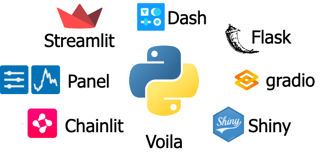

# Exploring UI-Frameworks
Learn how to use UI frameworks like Streamlit, Gradio, Dash, and more to build amazing AI applications.

### How to Choose

- For Quick ML Demos: Start with Gradio.
- For Rapid Data App Prototypes: Use Streamlit.
- For Enterprise-Grade, Highly Custom Dashboards: Choose Dash.
- For Jupyter-Centric Workflows: Try Voila or Panel.
- For Advanced AI/LLM Apps: Consider Chainlit or Taipy. 

## Key Frameworks Compared

## Streamlit:

Best For: Rapid prototyping, internal tools, simple data apps.

Pros: Very easy to learn, simple syntax, great for quick results, large community.

Cons: Less layout control than Dash, can struggle with large-scale apps.

## Gradio:

Best For: Quick demos of ML models (Hugging Face focus).

Pros: Extremely easy setup for ML UIs, ideal for sharing models.

Cons: More limited visual customization than Streamlit or Dash.

## Dash (Plotly):

Best For: Enterprise dashboards, complex analytics, full design control.

Pros: Highly customizable (HTML/CSS/React), powerful for production apps.

Cons: Steeper learning curve, more boilerplate code. 

## Other Notable Options

**Panel:** Flexible for dashboards with multiple plotting libraries (Bokeh, Plotly, etc.).

**Shiny for Python:** Excellent for R users transitioning to Python for interactive web apps.

**Chainlit:** Built specifically for LLM (Large Language Model) applications.

**Taipy:** Modern, Pythonic framework for robust data-driven apps and dashboards.

**Voila:** Converts Jupyter Notebooks directly into web apps. 
