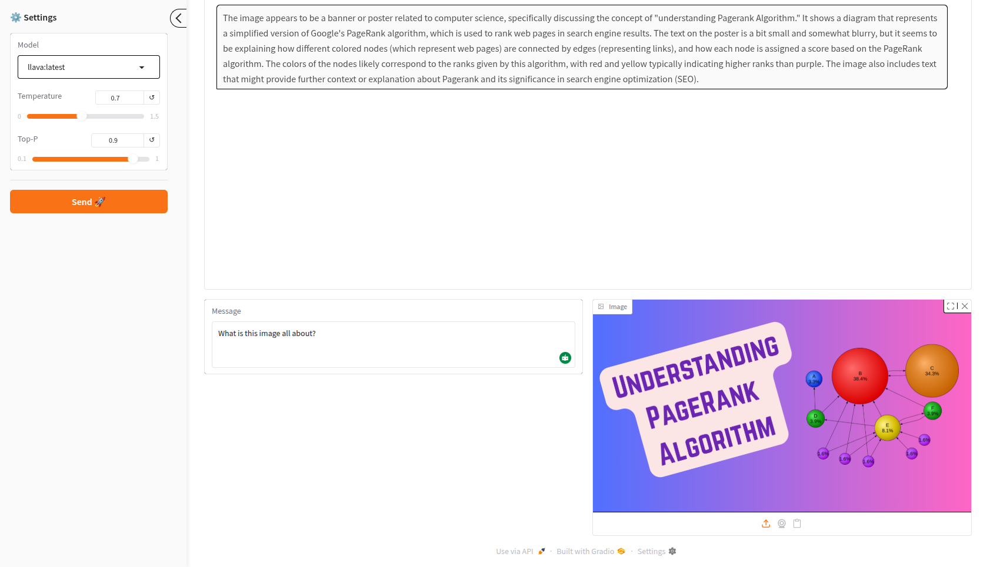

## Building a Multimodal Chatbot With Gradio and Ollama

**Features**

- 📚 Support for multiple models (LLaMA, Qwen, etc.)
- 📸 Image support for vision models
- 📄 Persistent chat history
- 📱 Responsive UI with Customizable styling

**Gradio UI**



### Project Structure

```
multimodal-chatbot/
├── app.py
├── config/
│   └── models.py
├── core/
│   ├── image_utils.py
│   ├── ollama_client.py
│   └── storage.py
├── data/
│   └── chats/
│       └── chat_history.json
├── requirements.txt
└── ui/
    └── layout.py
```

