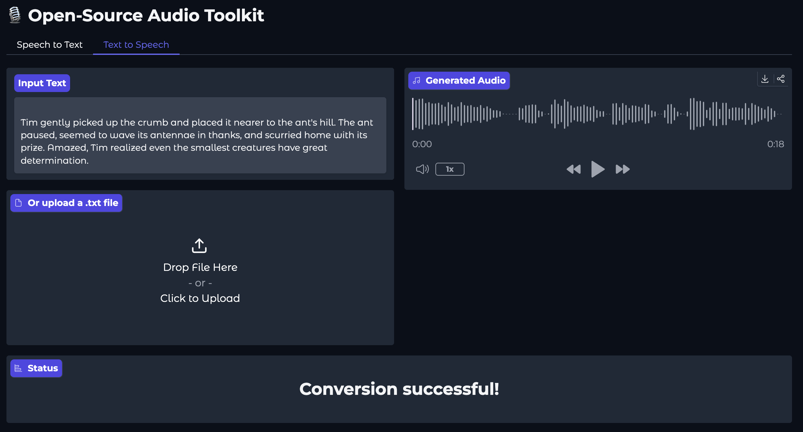

### 🚀 Building Real-time ASR and TTS with Gradio + Whisper + gTTS

This repository contains a Gradio application that demonstrates real-time automatic speech recognition (ASR) and text-to-speech (TTS) using OpenAI's Whisper model. The app captures audio input from the user, processes it with the Whisper model, and displays the transcribed text in real-time.

### Features

ASR and TTS Application Features:

- Real-time audio capture from microphone or upload mp3 file.
- Integration with OpenAI's Whisper model for accurate transcription
- TTS: Upload text files or type-in your text for speech synthesis
- Play synthesized speech directly in the app

Gradio Interface:

### Requirements
- Python 3.7 or higher
- Gradio
- OpenAI Whisper (for ASR model)
- gTTS 
- numpy
