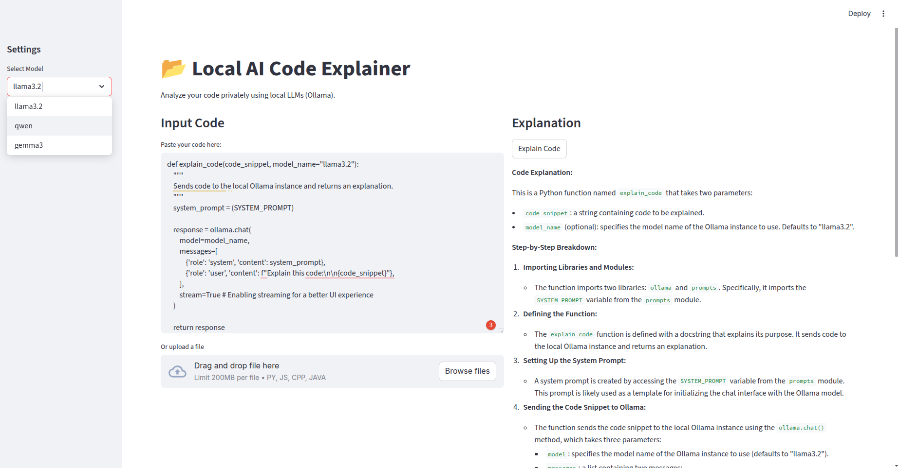

### AI Code Explainer

To build a AI Code Explainer, we'll use the open-source tools like Ollama and Streamlit.

**Key Learnings**

1. How to build the Streamlit-UI
2. System Prompt for instructing the models
3. Open-Source tooling

**Code Explainer UI**



### **Project Structure**

```bash
AI Code Explainer/
├── code_explainer.py  # Streamlit UI and session management
├── llm_engine.py       # LLM call to explain the code
├── prompts.py           # System prompt or Instruction prompt
└── requirements.txt    # Python dependencies
```

### Installation

```bash
python3 -m venv deepagent-env
source deepagent-env/bin/activate
pip install -r requirements.txt
```