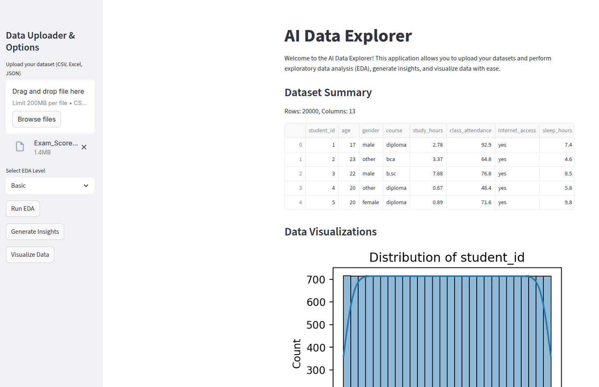

### 🚀 Building Simple AI Data Explorer

Build a data explorer using open-source tools like streamlit, ollama, scikit-learn, and seaborn.

- Data input (CSV, xlsx, parquet)
- Basic and Smart EDA
- LLM Insight from EDA
- Visualization

### Data Explorer UI



### Project Structure

```bash
AI Data Explorer/
├── app.py
├── requirements.txt
├── core/
│   ├── eda.py
│   ├── visualizer.py
│   ├── insights.py
|   ├── schema.py
|   ├── loader.py
│   └── prompts.py
└── readme.md
```

### Installation

```bash
python3 -m venv deepagent-env
source deepagent-env/bin/activate
pip install -r requirements.txt
```
