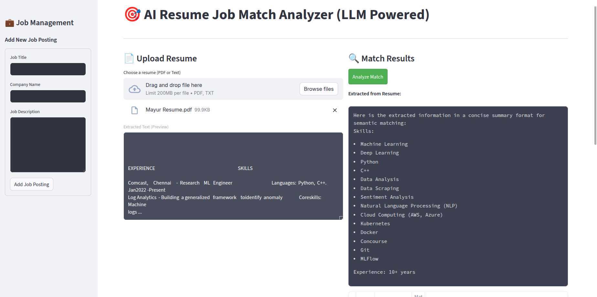

## 🔥 AI Resume-Job Match Analyzer

This is a Streamlit app that analyzes the match between a resume and a job description.

1. All job postings are stored in the form a vector database as vectors.
2. Given a resume, turn it into a vector which semantically represents the resume.
3. Use semantic search to find the best matching job postings.
4. Display the results in a table.

### Key Learnings

- Setting and Managing Database (CRUD)
- LLM Handler
- Data Ingestion
- Streamlit UI

## Resume Job Match Analyzer UI



### Project Structure

```
Resume-Job-Match-Analyzer/
    ├── app.py
    ├── database.py
    └── embeddings.py
    └── llm_handler.py
    └── ingest_csv.py
    └── requirements.txt
    └── test_chroma.py
    └── jobstreet_all_job_dataset.csv
```