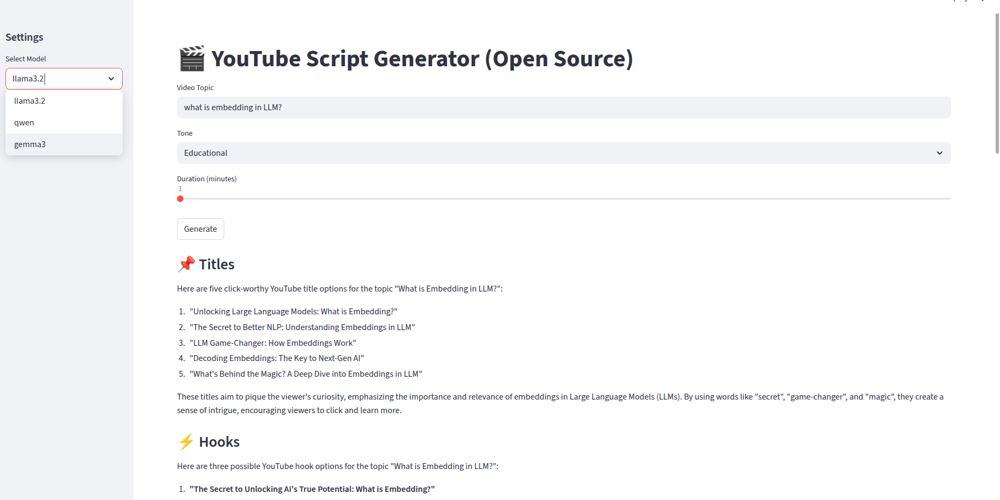

## 🚀Building YouTube Script Generator Using Open-Source Tools

Learn how to build a YouTube Script Generator using Streamlit, Langchain, Ollama, and Powerfull LLMs (qwen, llama3.2, gemma3).

### YouTube Script Generator UI



### Project Structure

```bash
youtube-script-generator/
├── app.py                     # Streamlit entry point
├── requirements.txt
├── README.md
├── llm/
│   ├── ollama_client.py        # Ollama LLM wrapper
├── prompts/
│   └── prompts.py              # script, title, hook prompts
└── tools/
    └── generator.py            #LLMChain to call LLM with specific prompts.
```

### Setting up Environment

```bash
python3 -m venv deepagent-env
source deepagent-env/bin/activate
pip install -r requirements.txt
```

### Ollama Installation and Model Downloads

```bash
curl -fsSL https://ollama.com/install.sh | sh
ollama pull llama3.2
ollama pull gemma3
ollama pull qwen
```